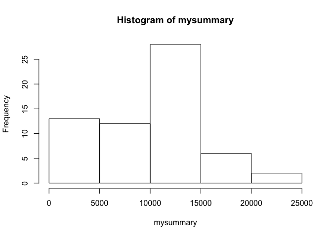
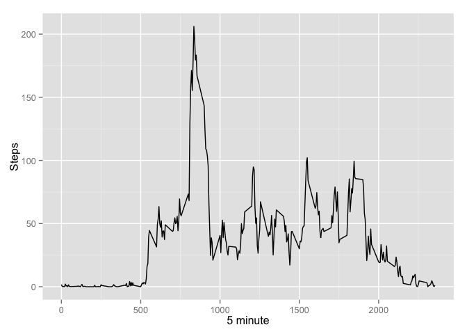
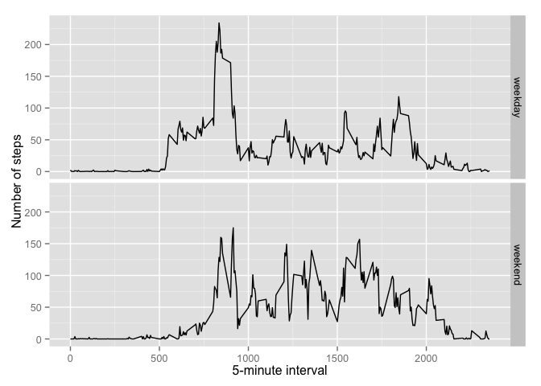

# Reproducible Research: Peer Assessment 1


## Loading and preprocessing the data


```r
activity <- read.csv("activity.csv")
summary(activity)
```

```
##      steps                date          interval     
##  Min.   :  0.00   2012-10-01:  288   Min.   :   0.0  
##  1st Qu.:  0.00   2012-10-02:  288   1st Qu.: 588.8  
##  Median :  0.00   2012-10-03:  288   Median :1177.5  
##  Mean   : 37.38   2012-10-04:  288   Mean   :1177.5  
##  3rd Qu.: 12.00   2012-10-05:  288   3rd Qu.:1766.2  
##  Max.   :806.00   2012-10-06:  288   Max.   :2355.0  
##  NA's   :2304     (Other)   :15840
```

## What is mean total number of steps taken per day?

First we need count steps by day

```r
mysummary <- tapply(activity$steps, activity$date, sum, na.rm = T)
hist(mysummary)
```

 

Now we can look the Mean and Median

```r
mean(mysummary, na.rm = T)
```

```
## [1] 9354.23
```

```r
median(mysummary, na.rm = T)
```

```
## [1] 10395
```

## What is the average daily activity pattern?


```r
library(ggplot2)
StepsByInterval <- aggregate(steps ~ interval, data = activity, mean, na.rm = TRUE)
ggplot(data = StepsByInterval, aes(x = interval, y = steps)) + geom_line() + xlab("5 minute") + ylab("Steps")
```

 

The interval with the major mean step daily

```r
StepsByInterval[StepsByInterval$steps == max(StepsByInterval$steps),]$interval
```

```
## [1] 835
```

## Imputing missing values

- Number of missing values 


```r
table(is.na(activity$steps))
```

```
## 
## FALSE  TRUE 
## 15264  2304
```

- Replace missing values by the step day mean and set that in new Dataset


```r
StepsByDays  <- aggregate(steps ~ date, data = activity, mean, na.rm = TRUE)
getMean <- function(date,step){
    data <- NA
    if(is.na(step))
        data <-  (StepsByDays[StepsByDays$date == date,]$steps)
    else
        data <-  c(step)
    return(data)
}
activity_copy  <- activity
activity_copy$steps  <- mapply(getMean,activity_copy$date,activity_copy$steps)
table(is.na(activity_copy$steps))
```

```
## 
## FALSE 
## 17568
```

- new hist without NA's values


## Are there differences in activity patterns between weekdays and weekends?


```r
filled.data <- activity
weekday.or.weekend <- function(date) {
    day <- weekdays(date)
    if (day %in% c("Monday", "Tuesday", "Wednesday", "Thursday", "Friday")) 
        return("weekday") else if (day %in% c("Saturday", "Sunday")) 
        return("weekend") else stop("invalid date")
}
filled.data$date <- as.Date(filled.data$date)
filled.data$day <- sapply(filled.data$date, FUN = weekday.or.weekend)


averages <- aggregate(steps ~ interval + day, data = filled.data, mean)
ggplot(averages, aes(interval, steps)) + geom_line() + facet_grid(day ~ .) + 
    xlab("5-minute interval") + ylab("Number of steps")
```

 
